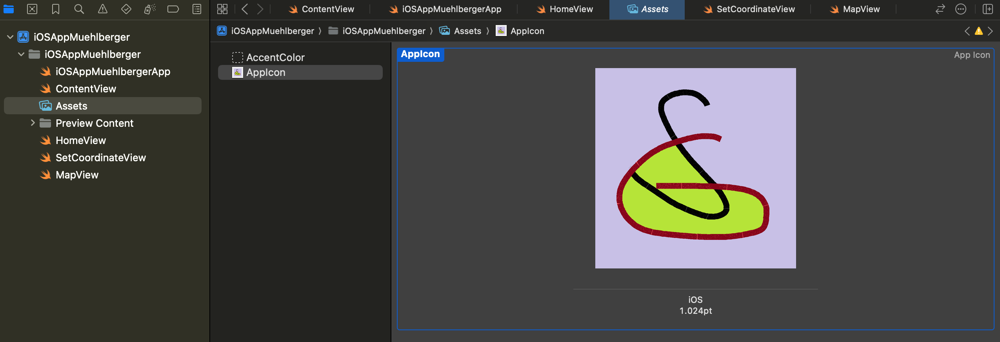
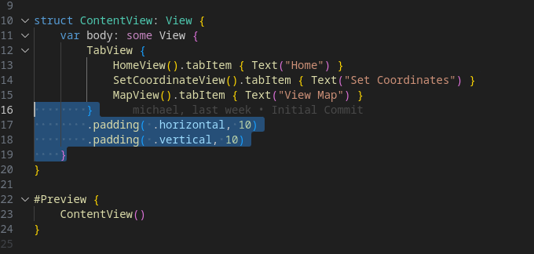
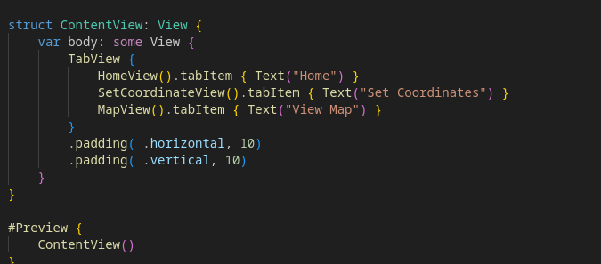
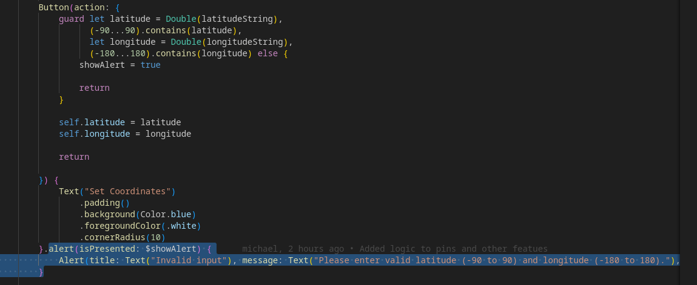
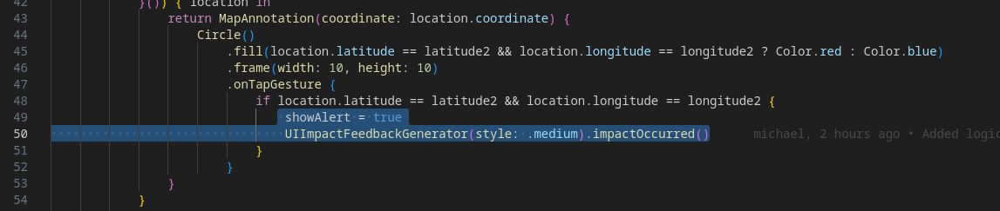

# iOS App - SetAndGo
## Author: Michael Muehlberger

## Included Features

    Features in the App:
     - Logo and UI (with Layout Whitespace)
         - Logo:
   

         - Layout with Whitespace ( this feature was implemented in  several parts of the code, example in ContentView:)
   

     
     - Navigation (Tab View + Pop Up)

        - Tab View 
        in ContentView:
   
        
        - Pop Up:

        in SetCoordinateView and MapView
        eg: code in SetCoordinateView
   
     
     - Location Service (Showing Map)
       in MapView
   
        
     
     - Data Binding (Saving State)
     in MapView and SetCoordinateView
     eg. in SetCoordinateView
   
     
     - Activator (Vibration)
     in MapView
   

## How to use the App (SetAndFind):
SetAndFind is an iOS App in which you can set a Pin inside the "Set Coordinates" Tab and afterwards try to find the location on the Map. The App has 3 Views:

HomeView: Instructions of how to App works
SetCoordinateView: Set Coordinate which will then be set on the MapView
MapView: If a pin was set in the SetCoordinateView you can try to find that pin on the map. If you found it and you tab on it, you won (Alert + Vibration)!

Percent: 100% because 5 features were implemented.
